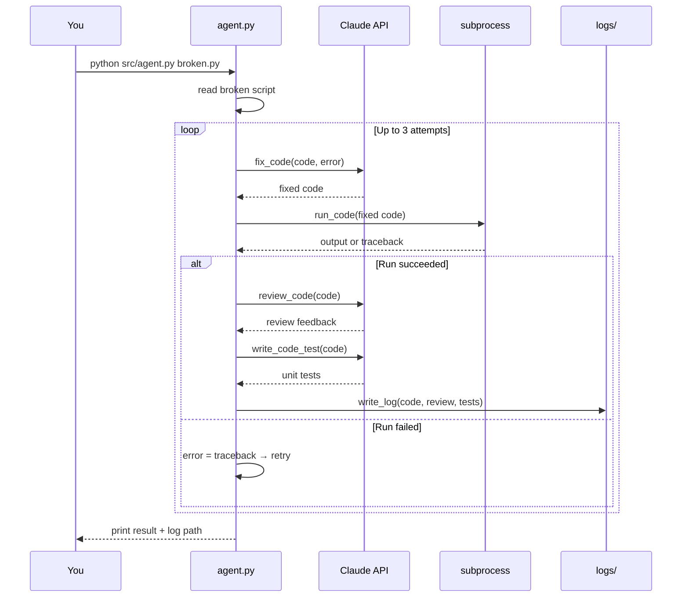
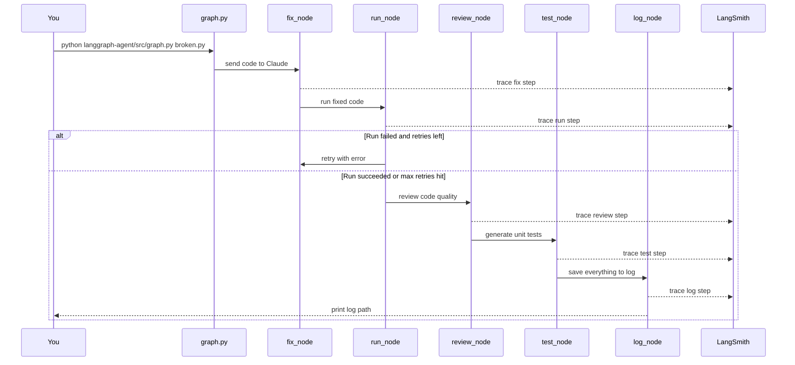
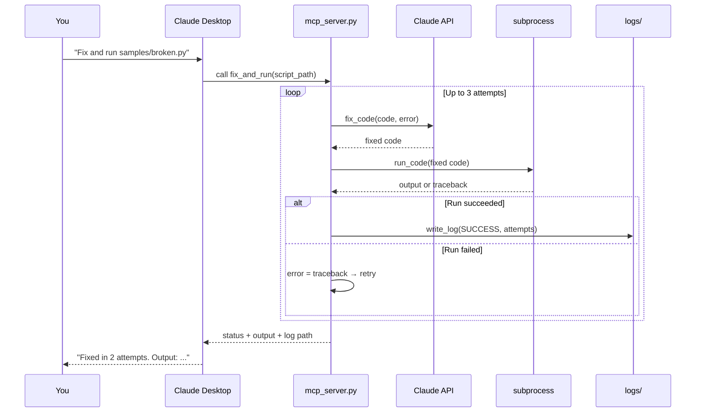

# Python Script Doctor & Logger

An agent that takes a broken Python script, fixes it with Claude AI, runs it, reviews it, generates tests, and logs everything. Available as a CLI tool, an MCP server, and a LangGraph multi-agent flow.

## The Pipeline

```
[ Broken Code ] → [ Fix ] → [ Run ] → [ Review ] → [ Test ] → [ Log ]
                               ↑           ↑
                          retry loop   LangSmith
                         (up to 3x)    tracing
```

| Step | What Happens |
|---|---|
| Fix | Sends broken code to Claude → gets fixed code back |
| Run | Runs the fixed code using Python subprocess |
| Review | Claude reviews the fixed code for quality and best practices |
| Test | Claude generates pytest unit tests for the fixed code |
| Log | Saves fixed code, review, and tests to a timestamped log file |

If execution fails, the real error is fed back to Claude and the cycle retries (up to 3 times). That feedback loop is what makes this an **agent**, not just a script.

---

## Three Ways to Use It

| Mode | How | Tracing |
|---|---|---|
| CLI | `venv/bin/python src/agent.py yourfile.py` | None |
| MCP Server | Say "Fix and run samples/file.py" in Claude Desktop | None |
| LangGraph | `venv/bin/python langgraph-agent/src/graph.py yourfile.py` | LangSmith |

---

## How It Works — Sequence Diagrams

### CLI Flow (with retry loop)



---

### LangGraph Flow (multi-agent with tracing)



---

### MCP Server Flow



---

## Setup

```bash
# 1. Create venv with Python 3.11 (quote the path if it contains spaces)
python3.11 -m venv venv

# 2. Install dependencies
venv/bin/pip install --upgrade pip
venv/bin/pip install -r requirements.txt

# 3. Create your .env file
cp .env.example .env
# Edit .env → add your real Anthropic API key
# Optional: add LANGCHAIN_API_KEY for LangSmith tracing

# 4. Add billing credits
# https://console.anthropic.com → Billing → Add credits ($5 minimum)
```

---

## CLI Usage

```bash
# Always run from the project root (code-review-agent/)

# Test with syntax bugs (should fix in 1 attempt)
venv/bin/python src/agent.py samples/broken_example.py

# Test with runtime errors (exercises the retry loop)
venv/bin/python src/agent.py samples/broken_hard.py

# Check logs (contains fixed code, review, and tests)
ls logs/
cat logs/<latest>.log
```

---

## LangGraph Usage

```bash
# Run the multi-agent flow (traces appear in LangSmith)
venv/bin/python langgraph-agent/src/graph.py samples/broken_example.py

# View traces at https://smith.langchain.com
```

---

## MCP Server Usage

The server is registered in `~/Library/Application Support/Claude/claude_desktop_config.json`.

Restart Claude Desktop, then in any chat say:

| What you say | Tool called |
|---|---|
| "Fix and run samples/broken_example.py" | `fix_and_run` |
| "Show my script doctor logs" | `list_logs` |
| "Read the latest log" | `read_log` |

Verify it's connected: ask Claude "What MCP tools do you have?" — it should list all three.

---

## Project Structure

```
code-review-agent/
├── src/
│   ├── agent.py            ← CLI agent (fix, run, review, test, log)
│   └── mcp_server.py       ← MCP server (fix_and_run, list_logs, read_log)
├── langgraph-agent/
│   └── src/
│       ├── state.py        ← shared AgentState TypedDict
│       ├── nodes.py        ← fix, run, review, test, log nodes
│       └── graph.py        ← wires nodes into a runnable graph
├── samples/
│   ├── broken_example.py   ← 4 syntax bugs
│   └── broken_hard.py      ← runtime errors (exercises retry loop)
├── tests/
│   └── test_agent.py       ← 16 pytest tests (one per spec)
├── docs/
│   ├── status.md           ← current state
│   ├── progress.md         ← session-by-session log
│   └── decision.md         ← why key choices were made
├── logs/                   ← auto-created on first run (gitignored)
├── venv/                   ← Python 3.11 virtual environment (gitignored)
├── .env                    ← your real API key (gitignored)
├── .env.example            ← safe template to share
├── SPEC.md                 ← behavioral contract for agent.py functions
├── CLAUDE.md               ← Claude Code session conventions
├── requirements.txt
└── README.md
```

## What You'll Learn

- How to call the Anthropic API from Python
- How AI agents use retry loops (the agentic loop)
- How to execute code programmatically with subprocess
- How to store secrets safely with .env files
- How to log structured data to files (the MLOps entry point)
- How MCP servers expose Python functions as tools Claude can call
- How LangGraph turns agent logic into a visual, traceable graph
- Why LangSmith only traces LangChain/LangGraph calls (not raw SDK calls)
- Why paths with spaces must always be quoted in shell commands
